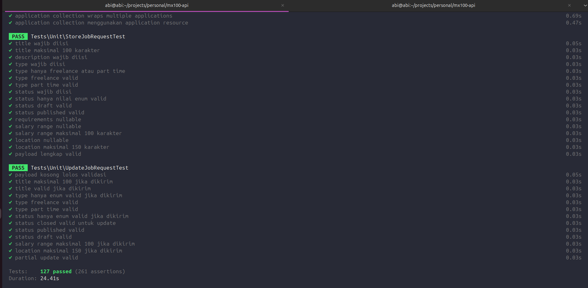

# MX100 Job Portal API

---

## Tentang Project

MX100 adalah job portal API yang memungkinkan:

- **Employer** — membuat dan memposting lowongan kerja, menyimpan sebagai draft atau langsung publish, serta melihat CV dari setiap pelamar.
- **Freelancer** — melihat daftar lowongan yang dipublish, melakukan filter & search, dan mengirimkan satu CV per lowongan.

### Aturan Bisnis Utama

| Aturan | Implementasi |
|---|---|
| Freelancer hanya bisa melihat job `published` | Scope `published()` + repository filter |
| Freelancer hanya bisa apply 1 CV per job | Cek di `ApplicationService` + `UNIQUE(job_id, freelancer_id)` di DB |
| Job `published` tidak bisa langsung dihapus | Validasi di `JobService::delete()` |
| Job `closed` tidak bisa di-reopen | Validasi di `JobService::update()` |
| Employer hanya bisa akses job & CV miliknya sendiri | Ownership check di Service + Repository |
| File CV tidak pernah ter-expose ke publik | Disimpan di `storage/private`, akses via endpoint protected |

---

## Tech Stack

| Layer | Teknologi |
|---|---|
| Framework | Laravel 13.2.0 |
| Language | PHP 8.4.1 |
| Database | PostgreSQL 16 |
| Authentication | Laravel Sanctum (Bearer token) |
| Authorization | Spatie Laravel Permission |
| Query Builder | Spatie Laravel Query Builder |
| DTO | Spatie Laravel Data |
| Primary Key | ULID (sortable, URL-safe) |
| File Storage | Laravel Storage (private disk) |

---

## Requirements

Pastikan environment kamu memenuhi requirement berikut sebelum instalasi:

| Software | Versi Minimum |
|---|---|
| **PHP** | 8.4 atau lebih baru |
| **Composer** | 2.8 atau lebih baru |
| **Node.js & NPM** | Versi terbaru (LTS) |
| **PostgreSQL** | 16 atau lebih baru |

### PHP Extensions yang diperlukan

```
pdo_pgsql
mbstring
openssl
tokenizer
xml
ctype
json
bcmath
fileinfo
```

Cek ekstensi yang aktif:
```bash
php -m
```

---

## Instalasi & Setup

### 1. Clone Repository

```bash
git clone https://github.com/your-repo/mx100-api.git
cd mx100-api
```

### 2. Install PHP Dependencies

```bash
composer install
```

### 3. Install Node Dependencies

```bash
npm install
```

### 4. Salin File Environment

```bash
cp .env.example .env
```

### 5. Generate Application Key

```bash
php artisan key:generate
```

---

## Konfigurasi Database

### Buat Database PostgreSQL

```sql
-- Untuk aplikasi utama
CREATE DATABASE mx100_db_prod;

-- Untuk testing (wajib jika ingin run test)
CREATE DATABASE mx100_db_prod_testing;
```

### Konfigurasi `.env`

Buka file `.env` dan sesuaikan bagian berikut:

```env
# PostgreSQL
DB_CONNECTION=pgsql
DB_HOST=127.0.0.1
DB_PORT=5432
DB_DATABASE=mx100_db_prod
DB_USERNAME=postgres
DB_PASSWORD=Postgres@1234

# Cache & Queue
CACHE_STORE=database
QUEUE_CONNECTION=database
SESSION_DRIVER=array

Note:
- Untuk DB_PASSWORD by default itu kosong (Biasanya kalau di Windows pakai Laragon si DB_PASSWORD postgresnya kosong)
- Hanya saja karena saya di lingkungan Linux jadi saya pakai password di project test ini
- Jadi disesuaikan saja ya untuk DB_PASSWORD nya
```

### Jalankan Migration

```bash
# Migration + seed data dummy sekaligus
php artisan migrate --seed

# Atau jika ingin fresh dari awal
php artisan migrate:fresh --seed
```

### Setup Storage

```bash
php artisan storage:link
```

---

## Menjalankan Aplikasi

```bash
composer run dev (Server + Vite) -> Rekomendasi saya pakai ini aja mas

atau

php artisan serve
```

Aplikasi akan berjalan di: `http://localhost:8000`

---

## Arsitektur

Project ini menggunakan **Modular Monolith** dengan pattern:

```
HTTP Request
    └── Middleware (RateLimit + Auth + Role)
        └── Controller (only thin — hanya terima & kembalikan response)
            └── Form Request (validasi input)
                └── DTO (typed data transfer)
                    └── Service (semua business logic)
                        └── Repository (data access layer)
                            └── Eloquent Model
                                └── PostgreSQL
```

**Response format konsisten** di semua endpoint:

```json
// Success
{
  "success": true,
  "message": "Pesan sukses.",
  "data": { ... },
  "meta": { "current_page": 1, "total": 42 },
  "links": { "first": "...", "next": "..." }
}

// Error
{
  "success": false,
  "message": "Pesan error.",
  "errors": { "field": ["detail error"] } (Optional)
}
```

---

## API Endpoints

Base URL: `http://localhost:8000/api/v1`

### Auth (Public)

| Method | Endpoint | Deskripsi |
|---|---|---|
| `POST` | `/auth/register` | Daftar sebagai employer atau freelancer |
| `POST` | `/auth/login` | Login, mendapat Bearer token |

### Auth (Protected — `auth:sanctum`)

| Method | Endpoint | Deskripsi |
|---|---|---|
| `GET` | `/auth/me` | Profil user yang sedang login |
| `POST` | `/auth/logout` | Logout device saat ini |
| `POST` | `/auth/logout-all` | Logout semua device |

### Employer (`role:employer`)

| Method | Endpoint | Deskripsi |
|---|---|---|
| `GET` | `/employer/jobs` | List semua job milik employer |
| `POST` | `/employer/jobs` | Buat job baru (draft/published) |
| `GET` | `/employer/jobs/{id}` | Detail job |
| `PUT/PATCH` | `/employer/jobs/{id}` | Update job |
| `DELETE` | `/employer/jobs/{id}` | Hapus job (hanya draft) |
| `GET` | `/employer/jobs/{id}/applications` | List semua CV pelamar |
| `GET` | `/employer/applications/{id}` | Detail satu lamaran |
| `GET` | `/employer/applications/{id}/cv` | Download file CV |

### Freelancer (`role:freelancer`)

| Method | Endpoint | Deskripsi |
|---|---|---|
| `GET` | `/freelancer/jobs` | List semua job published |
| `GET` | `/freelancer/jobs/{id}` | Detail job published |
| `POST` | `/freelancer/jobs/{id}/apply` | Kirim lamaran CV |
| `GET` | `/freelancer/applications` | Riwayat lamaran saya |

### Query Parameters — Browse Job

```
GET /api/v1/freelancer/jobs?filter[type]=freelancer
GET /api/v1/freelancer/jobs?filter[type]=parttime
GET /api/v1/freelancer/jobs?filter[search]=laravel
GET /api/v1/freelancer/jobs?filter[location]=jakarta
GET /api/v1/freelancer/jobs?sort=-published_at
GET /api/v1/freelancer/jobs?per_page=10
```

---

## Testing

### Setup Configuration Testing

```sql
php artisan key:generate --env=testing
```

### Setup Database Test

Pastikan database `mx100_db_prod_testing` sudah dibuat:

```sql
CREATE DATABASE mx100_db_prod_testing;
```

### Konfigurasi `.env.testing`

Buka file `.env.testing` dan sesuaikan bagian berikut:

```env
# PostgreSQL
DB_CONNECTION=pgsql
DB_HOST=127.0.0.1
DB_PORT=5432
DB_DATABASE=mx100_db_prod_testing
DB_USERNAME=postgres
DB_PASSWORD=Postgres@1234

# Cache & Queue
CACHE_STORE=database
QUEUE_CONNECTION=database
SESSION_DRIVER=array

Note:
- Untuk DB_PASSWORD by default itu kosong (Biasanya kalau di Windows pakai Laragon si DB_PASSWORD postgresnya kosong)
- Hanya saja karena saya di lingkungan Linux jadi saya pakai password di project test ini
- Jadi disesuaikan saja ya untuk DB_PASSWORD nya
```

File `phpunit.xml` sudah dikonfigurasi untuk PostgreSQL test database. Pastikan konfigurasi di `phpunit.xml` sesuai dengan kredensial PostgreSQL sampeyan mas.

### Seed Env Testing

```bash
php artisan migrate:refresh --seed --env=testing
```


### Menjalankan Semua Test

```bash
php artisan test
```

### Result Testing



---

## Postman Collection

Collection API sudah saya siapkan untuk proses testingnya biar lebih efisien bisa di download aja mas di disini folder nya

📁 **Lokasi file:** `postman/MX100 Job Portal API.postman_collection.json`

## Akun Demo

| Role         | Email | Password | Keterangan        |
|--------------|---|---|-------------------|
| Employer 1   | `maskurniawan@gmail.com` | `maskurniawan12345` | Akun employer 1   |
| Employer 2   | `bimanyu@gmail.com` | `bimanyu12345` | Akun employer 2   |
| Freelancer 1 | `puntodewo@gmail.com` | `puntodewo12345` | Akun freelancer 1 |
| Freelancer 2 | `werkudoro@gmail.com` | `werkudoro12345` | Akun freelancer 2 |
| Freelancer 3 | `janoko@gmail.com` | `janoko12345` | Akun freelancer 3 |

## Note Testing API

Saran dari saya kalau mau cepat testing development, lebih baik import file yang sudah saya berikan diatas atau letaknya disini 

📁 **Lokasi file:** `postman/MX100 Job Portal API.postman_collection.json` 

Setelah di import langsung aja di test by payload semuanya sudah saya siapkan tinggal di running saja.

-------------------------

Tapi, kalau mau pakai akun demo yang sudah saya berikan setelah melakukan **seed** saya persilakan juga bisa disesuaikan saja di postman. So far semuanya sudah ready mas

---

## Security

### Middleware yang Diterapkan

**`RateLimitingMiddleware`**

| Tier | Endpoint | Limit | Key |
|---|---|---|---|
| `auth` | `/auth/login`, `/auth/register` | 10 req/menit | Per IP |
| `api` | Semua protected route | 60 req/menit | Per User ID |

Response rate limit selalu menyertakan header:
- `X-RateLimit-Limit`
- `X-RateLimit-Remaining`
- `X-RateLimit-Reset`
- `Retry-After` (saat 429)

### Proteksi Data

- Password di-hash dengan **bcrypt** via Laravel `hashed` cast
- Sanctum token di-hash **SHA-256** sebelum disimpan ke DB
- File CV disimpan di **private storage** — tidak accessible via URL publik
- `cv_path` tidak pernah muncul di response API
- ULID sebagai primary key — tidak bisa di-enumerate
